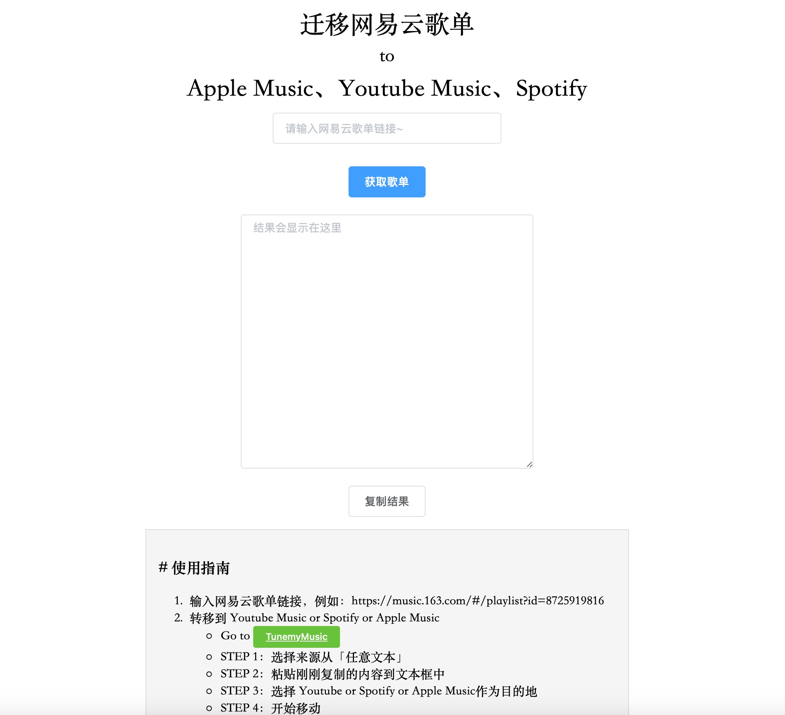
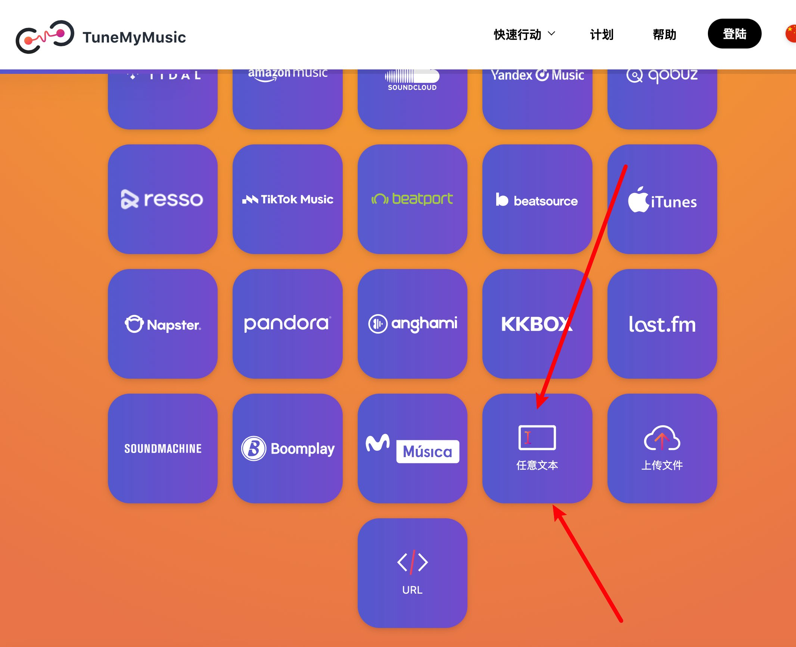
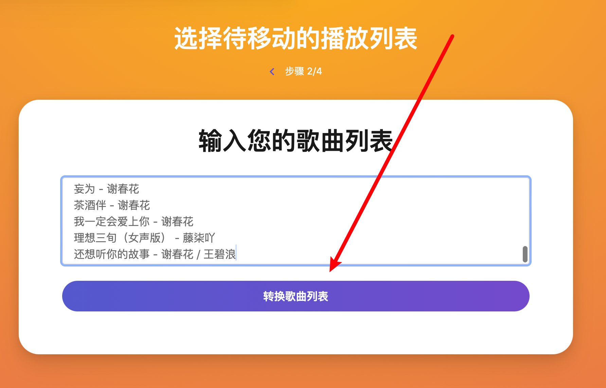

# 迁移网易云/QQ音乐歌单至-AppleMusic、YoutubeMusic、Spotify

链接：https://music.unmeta.cn

项目使用 Golang + Gin 开发，Redis 作为缓存中间件（如不使用则无需配置）。

```yaml
# 默认端口 8081
port: 8081

# redis 地址、密码
redis:
  dsn: "127.0.0.1:6379"
  password: "123456"
```



# 使用指南

1. 输入歌单链接，例如：https://music.163.com/#/playlist?id=8725919816
2. 转移到 Youtube Music or Spotify or Apple Music
   - Go to [TuneMyMusic](https://www.tunemymusic.com/zh-CN/transfer)
   - STEP 1：选择来源从「任意文本」
   - STEP 2：粘贴刚刚复制的内容到文本框中
   - STEP 3：选择 Youtube or Spotify or Apple Music作为目的地
   - STEP 4：开始移动





# 如何启动程序？

- 安装 Golang
- 将程序克隆至本地
- 编译并运行

```shell
git clone https://github.com/Bistutu/GoMusic.git
cd GoMusic
go build &&./GoMusic
```

