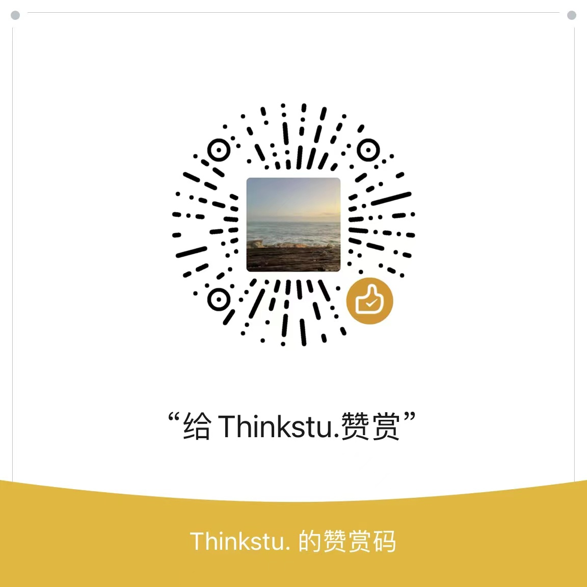

# 迁移网易云/QQ音乐歌单至 Apple/Youtube/Spotify Music

> 简体中文| [English](README_EN.md) | [한국어](README_KO.md)


链接：https://music.unmeta.cn

项目后端使用 Golang + Gin 开发，前端使用 Vue + ElementUI 编写。


# 使用指南

1. 输入歌单链接，如：http://163cn.tv/zoIxm3
2. 复制查询结果
3. 打开 **[TunemyMusic](https://www.tunemymusic.com/zh-CN/transfer)** 网站
4. 选择歌单来源“任意文本”，将刚刚复制的歌单粘贴进去，选择 Apple/Youtube/Spotify Music 作为目的地，确认迁移


# 如何启动程序？

- 安装 Golang
- 将程序克隆至本地
- 编译并运行

```shell
git clone https://github.com/Bistutu/GoMusic.git
cd GoMusic
go build &&./GoMusic
```


## Star 历史记录

[](https://star-history.com/#Bistutu/GoMusic&Date)


# 请作者喝杯咖啡☕️

如果觉得程序对你有所帮助，不妨请作者喝杯咖啡~




# 特别鸣谢

1. ThinkStu，程序开拓者 👩🏻‍🚀
2. aptheparker，多语言版本贡献者
3. …
