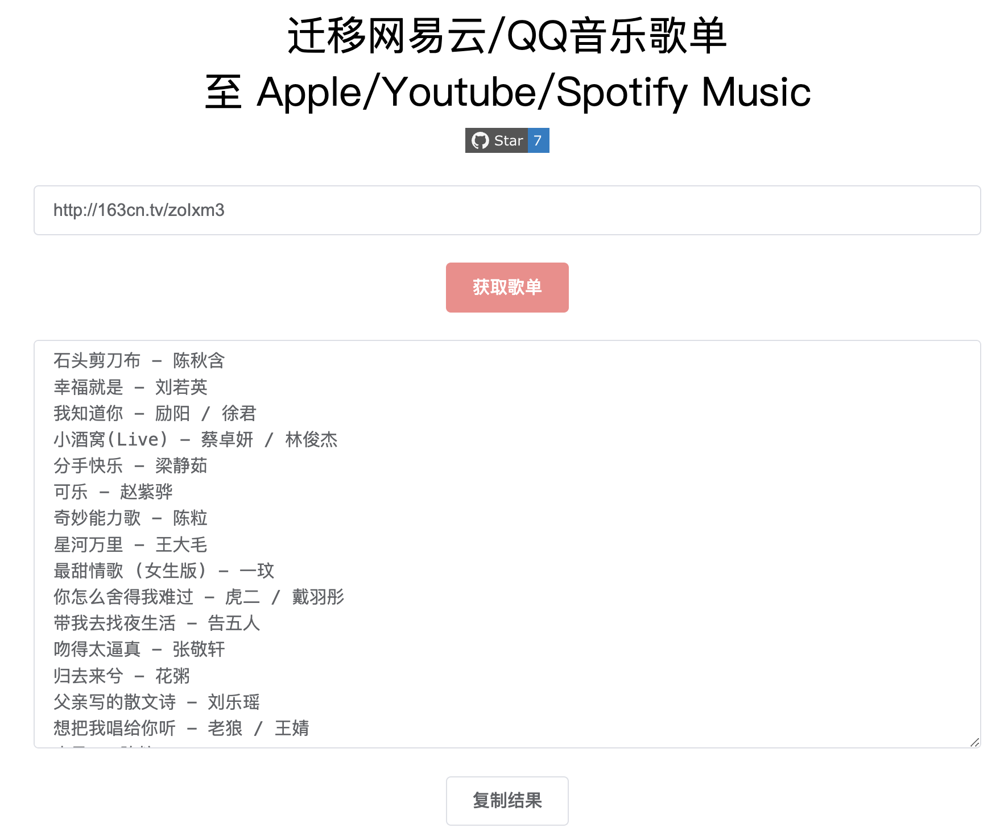
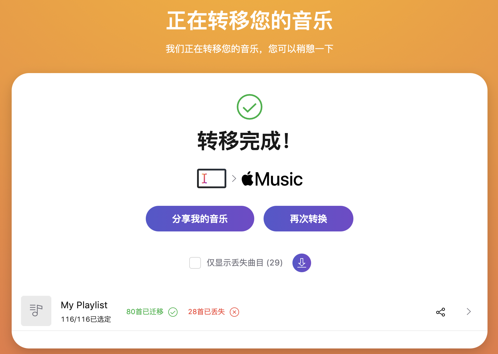

# 迁移网易云/QQ音乐歌单至 Apple/Youtube/Spotify Music

链接：https://music.unmeta.cn

项目后端使用 Golang + Gin 开发，前端使用 Vue + ElementUI 编写。




# 使用指南

1. 输入歌单链接，如：http://163cn.tv/zoIxm3
2. 复制查询结果
3. 打开 **[TunemyMusic](https://www.tunemymusic.com/zh-CN/transfer)** 网站
4. 选择歌单来源“任意文本”，将刚刚复制的歌单粘贴进去，选择 Apple/Youtube/Spotify Music 作为目的地，确认迁移




# 如何启动程序？

- 安装 Golang
- 将程序克隆至本地
- 编译并运行

```shell
git clone https://github.com/Bistutu/GoMusic.git
cd GoMusic
go build &&./GoMusic
```

