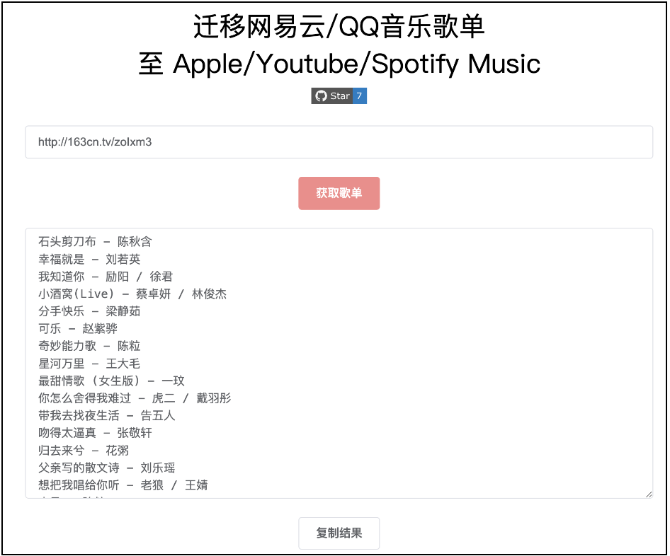

# 迁移网易云/汽水/QQ音乐歌单至 Apple/Youtube/Spotify Music

> 简体中文| [English](README_EN.md) | [한국어](README_KO.md)

链接：https://music.unmeta.cn

项目后端使用 Golang + Gin 开发，前端使用 Vue + ElementUI 编写。

# 使用指南

> 如何迁移至 Apple/Youtube/Spotify Music

1. 输入歌单链接，如：http://163cn.tv/zoIxm3
2. 复制查询结果
3. 打开 **[TunemyMusic](https://www.tunemymusic.com/zh-CN/transfer)** or **[Spotlistr](https://spotlistr.com/)** 网站
4. 选择歌单来源“任意文本”，将刚刚复制的歌单粘贴进去，选择 Apple/Youtube/Spotify Music 作为目的地，确认迁移

> 如何迁移至网易云/QQ音乐

见 GitHub issue：https://github.com/Bistutu/GoMusic/issues/17

# 如何部署？

详见 **[部署文档](DEPLOYMENT.md)**

## Star 历史记录

# 赞赏码

网站免费、开源、保持简单，如果你想支持作者，请使用微信扫描赞赏码，以下是赞赏榜的前10名赞助者（最后更新 2026.3.5）

| 序号 |        🌼赞助者🌼        | 赞助金额 |
| :--: | :--------------------: | :------: |
|  1   | 冰楠 ₿.Ξ 🧘 |    188    |
|  2   | 高胖胖 |    101    |
|  3   | 不疯就行 |    100    |
|  4   | 静 |    100    |
|  5   | 魏鹏程 |    88    |
|  6   | 什么长发及腰不如短发凉 |    87    |
|  7   |         Youyo🍊         |    66    |
|  8   |         安分wa         |    50    |
|  9   |           高小伦             |   50       |
|  10  |           平             |   30       |
