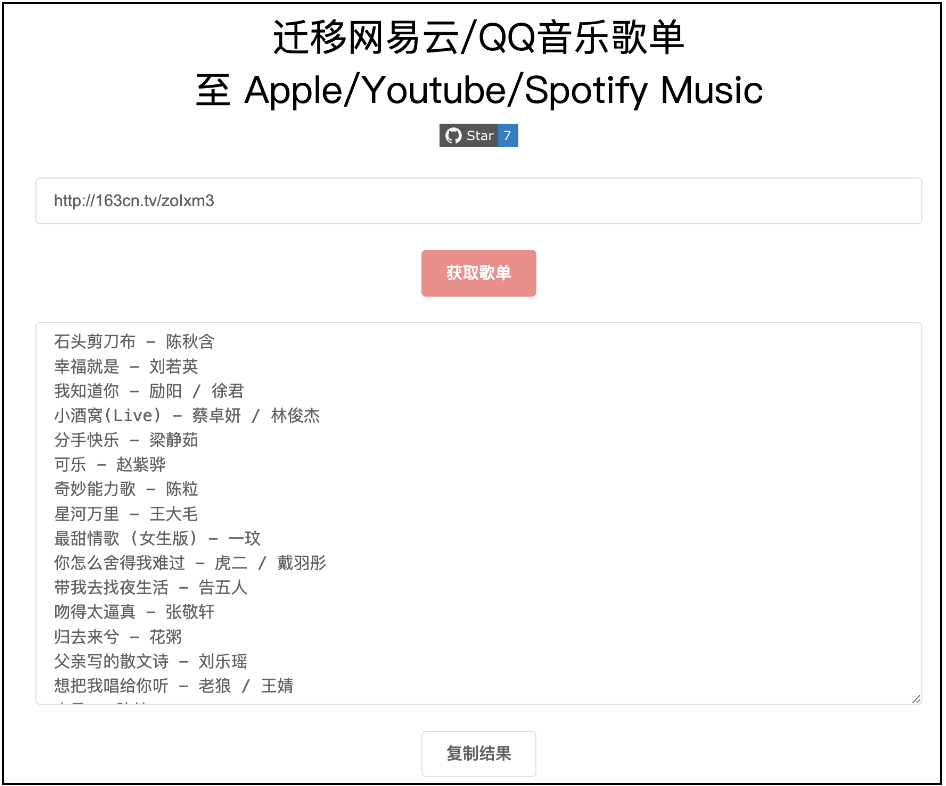

# 迁移网易云/QQ音乐歌单至 Apple/Youtube/Spotify Music

> 简体中文| [English](README_EN.md) | [한국어](README_KO.md)


链接：https://music.unmeta.cn

项目后端使用 Golang + Gin 开发，前端使用 Vue + ElementUI 编写。




# 使用指南

1. 输入歌单链接，如：http://163cn.tv/zoIxm3
2. 复制查询结果
3. 打开 **[TunemyMusic](https://www.tunemymusic.com/zh-CN/transfer)** 网站
4. 选择歌单来源“任意文本”，将刚刚复制的歌单粘贴进去，选择 Apple/Youtube/Spotify Music 作为目的地，确认迁移


# 如何启动程序？

- 安装 Golang
- 将程序克隆至本地
- 编译并运行

```shell
git clone https://github.com/Bistutu/GoMusic.git
cd GoMusic
go build &&./GoMusic
```


## Star 历史记录

[](https://star-history.com/#Bistutu/GoMusic&Date)


# 最重要的事情！

**春招求职！**

姓名：Chen Miankang

院校：北京信息科技大学 计算机专业  2024 届本科毕业生

专业技能：熟悉 Go 以及 Java 生态

实习经历：米哈游（半年）

独立开发者作品：[流畅阅读](https://github.com/Bistutu/FluentRead)、[音乐迁移网站](https://github.com/Bistutu/gomusic)、[空闲教室查询应用](https://github.com/Bistutu/BistuEmpty)

**在线简历**：[点击查看](https://thinkstu-typora.oss-cn-hangzhou.aliyuncs.com/typora/%E9%99%88%E7%BB%B5%E5%BA%B7-%E7%AE%80%E5%8E%86.pdf)

**联系方式**：1914493943@qq.com


