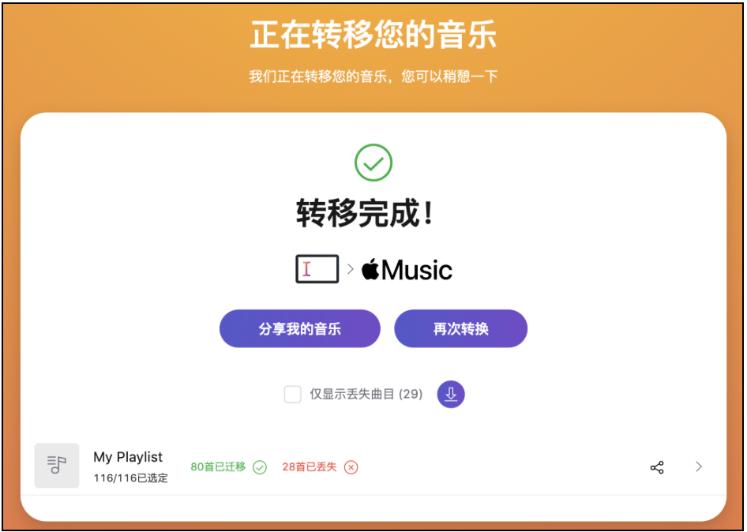

# 넷이즈/큐큐 음악 플레이리스트를 Apple/Youtube/Spotify Music으로 이전하기

> [简体中文](README.md)  | [English](README_EN.md) | 한국어

링크: [https://music.unmeta.cn](https://music.unmeta.cn)

이 프로젝트의 백엔드는 Golang + Gin을 사용하여 개발되었고, 프론트엔드는 Vue + ElementUI로 구축되었습니다.


# 사용 안내

1. 플레이리스트 링크 입력, 예: http://163cn.tv/zoIxm3
2. 검색 결과 복사
3. **[TunemyMusic](https://www.tunemymusic.com/ko/transfer)** 웹사이트 열기
4. 플레이리스트 출처로 "임의의 텍스트" 선택, 방금 복사한 플레이리스트 붙여넣기, 목적지로 Apple/Youtube/Spotify Music 선택 후 이전 확인



# 프로그램 시작 방법?

- Golang 설치
- 프로그램을 로컬로 클론
- 컴파일 후 실행

```shell
git clone https://github.com/Bistutu/GoMusic.git
cd GoMusic
go build && ./GoMusic
```

## 스타 이력 기록

[](https://star-history.com/#Bistutu/GoMusic&Date)